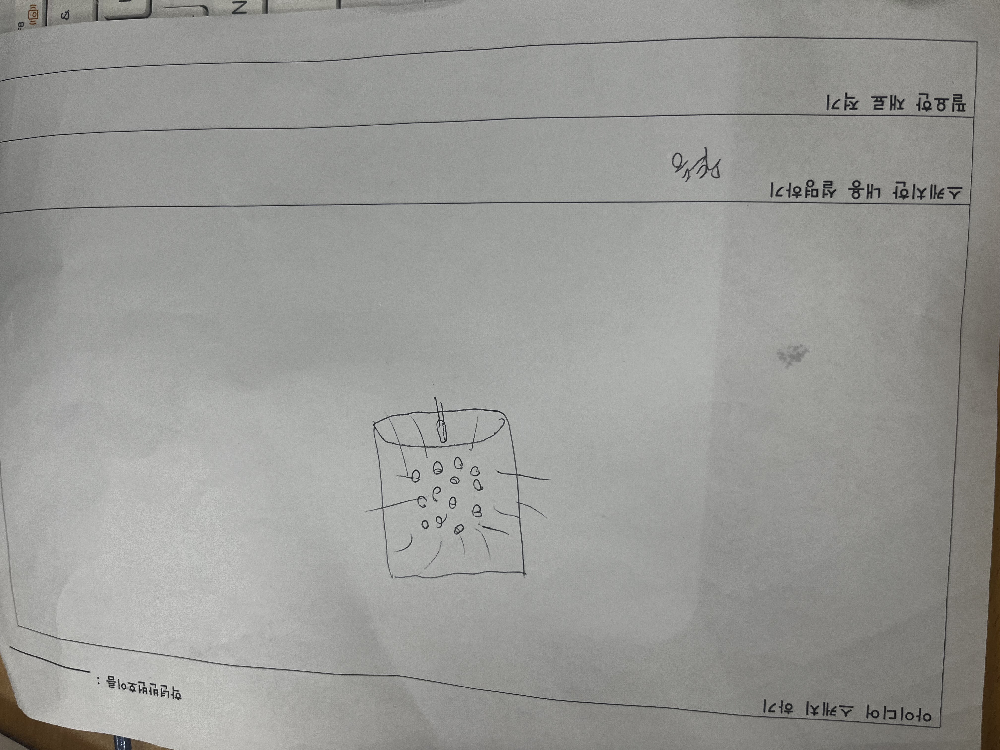
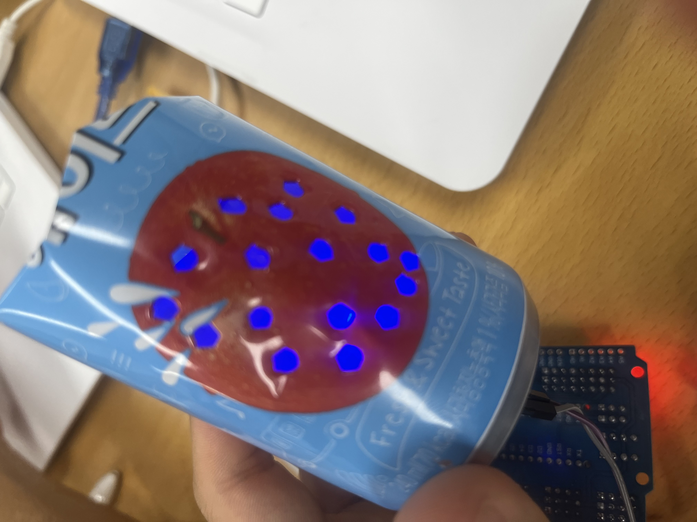

# 🌱 에코아트 프로젝트: [작품명]

## 📖 프로젝트 개요
- **제작자**: [문규빈]
- **제작일**: [7월16일]
- **소개**
> 얼마나 많은 쓰레기가 버려지는지 심각성을 알리기위해ㅣ
>  저희는 버려지는 플라스틱 쓰레기 문제의 심각성을 알리기 위해서 만들었다

## 📦 사용 재료
- 아두이노, 온도센서, LED, 브레드보드
- 캔, 그림 도안

## 🔧 제작 과정

### 1단계: 아이디어 스케치

### 2단계: 완성품

## 💭 제작 후기
### 잘된 점
- 밝고 잘나온다

### 아쉬운 점
- 작품의 퀄리티가 안나온다

### 개선할 점
- 작품의 마감

### 내가 이미 알고 있었던 것
- 업사이클링

### 새롭게 배운게 된 것
- 프로그래밍

### 더 알고 싶은 것
- 코드

## 🌍 환경적 의미
- 이 작품이 환경에 미치는 긍정적 영향
- 사용한 재활용 재료가 환경에 미치는 의미
- 앞으로의 환경 보호 다짐 등

## 📚 참고 자료
- [환경 관련 웹사이트](링크)
- [참고한 에코아트 작품](링크)

## 🏷️ 태그
#에코아트 #재활용 #환경보호 #DIY #창의활동

---

> 이 프로젝트는 환경 보호와 창의적 사고를 위한 교육 목적으로 제작되었습니다.
